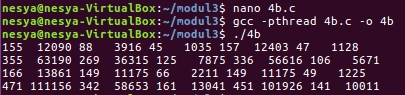

# SoalShiftSISOP20_modul3_T01
Repository ini Sebagai Laporan Resmi Soal Shift Modul 2 Praktikum Sistem Operasi 2020

### Disusun oleh :
- Anis Saidatur Rochma [05311840000002] 
- Kadek Nesya Kurniadewi [05311840000009]

## Soal 3


Solusi


```c
char cwd[100];
pthread_t threads[100];
pid_t child;
char *split_file[4],*split_path[20],nmfile[100],path[100];
int n = 0, m = 0;
 ```
 Pertama, deklarasikan variabel. 
 
```c
int main(int argc, char *argv[]) {
    if(getcwd(cwd, sizeof(cwd)) != NULL) {
        // printf("Current working dir: %s\n", cwd);
    }
    int i=0,k=0;
	int p;
    if (strcmp(argv[1],"-f") == 0) {
        for(k = 2 ; k < argc ; k++ ){
            int p;
            pthread_create(&(threads[i]),NULL,move,argv[k]);
            pthread_join(threads[i],NULL);
            i++;
        }
    }

```
- Mula-mula dilakukan pemanggilan fungsi `getcwd(get current working directory)` untuk menyimpan path working directory sekarang, yang nantinya adalah string path tsb akan disimpan pada array `cwd`. Karena di soal meminta untuk semua case, hasil pemindahan file dan folder yang dibuat harus ada di working directory dimana program tersebut dijalankan. 
Lalu untuk kasus pertama, saat argumen ke dua yang inputkan di terminal sama dengan `-f` maka akan dilakukan pengecekan. Jika benar, maka akan membuat threads sebanyak jumlah path yang diinputkan pada terminal, dan akan memanggil fungsi `move` untuk melakukan pengecekan dan pemindahan file serta membuat *directory*. Lalu jika 1 path telah selesai dilaksanakan maka akan melakukan proses join threads, dst nya

```c
void* move(void *arg) {
    strcpy(path,arg);
    char *temp,*temp1;

	unsigned long i=0;
	pthread_t id=pthread_self();
	int iter;

    temp1 = strtok(path, "/");
    while( temp1 != NULL ) {
        split_path[m] = temp1;
        m++;
        temp1 = strtok(NULL, "/");
    }
```
fungsi `move` = path yang diketikkan pada terminal akan disimpan dalam variabel arg lalu akan dicopy ke array path. Kemudian akan dilakukan pemisahan string path dengan fungsi `strtok` dimana string path tsb dipisahkan dengan field separatornya adalah tanda "/". Hasil pemisahan tsb kemudian dismpan dalam array `split_path`.

```c
strcpy(nama_file,split_path[m-1]);

    temp = strtok(split_path[m-1], ".");
    while( temp != NULL ) {

        split_file[n] = temp;
        n++;
        temp = strtok(NULL, ".");
    }
```
`split_path[m-1]` akan berisi sebuah nama file beserta ekstensinya yang didaptkan dari `strtok("/")`. Setelah itu nama file yang ada di `split_path[m-1]` tsb akan di copy ke array `nama_file`. Nantinya akan dilakukan pemisahan lagi untuk mendapatkan ekstensi dari nama file tsb. Dilakukan pemisahan nama file berdasarkan tanda "." yang nantinya hasil pemisahan akan disimpan pada array `split_file`.

```c
char lowerall[100];
    strcpy(lowerall,split_file[n-1]);
    for(int i = 0; lowerall[i]; i++){
        lowerall[i] = tolower(lowerall[i]);
    }
```
Karena pada soal ekstensi yang diinputkan di terminal tidak case yang sensitive, maka semua huruf ekstensi akan di kecilkan dengan menggunakan fungsi  `tolower`. Dimana `split_file[n-1]` yang berisi nama ekstensi ini akan di copy dulu ke array lowerall, lalu dilakukan proses pengecilan semua huruf yang ada di dalam looping.

```c
DIR *folder, *folderopen;
    struct dirent *entry;
    char place2[100],place3[100];
    folder = opendir(cwd);
    int isdir = 0;
    printf("n = %d\n",n);
    if( n > 1 ){

        if(folder == NULL)
        {
            printf("error\n");
        }
        while( (entry=readdir(folder)) )
        {

            if(strcmp(entry->d_name,lowerall) == 0 && entry->d_type == 4){
                isdir = 1;
                break;
            }
        }
```
Kodingan di atas akan melakukan pengecekan apakah directory sekarang (*current working directory*) ada isinya atau tidak. Hal itu dilakukan jika nilai n > 1 (artinya file tsb memiliki ekstensi). Jika cwd ada isinya, akan dilakukan sebuah persyaratan, jika nama file pada directory tsb dengan array lowerall sama dan return data entry->d_type = 4(artinya merupakan sebuah direktori), maka variabel isdir di set sama dengan 1 yang merupakan sebuah penanda.

```c
  if(isdir == 0){

            strcpy(place2,cwd);
            strcat(place2,"/");
            strcat(place2,lowerall);
            mkdir(place2, 0777);

        }
    }
    else{
        strcpy(place2,cwd);
        strcat(place2,"/");
        strcat(place2,"Unknown");
        mkdir(place2, 0777);
    }
```
variabel isdir tadi dilakukan pengecekan lagi untuk melaksanakan pembuatan folder. Jika isdir = 0 (artinya bukan sebuah directory, namun sebuah file) maka akan dibuat folder yang path tujuan folder dibuatnya ada di bagian place2. Llau jika bukan, artinya file tidak memiliki ekstensi dan akan dibuat folder "Unknown".

```c
else if (strcmp(argv[1],"-d") == 0 && argc == 3) {
        i = 0;
        DIR *fd, *fdo;
        struct dirent *folder;
        char pl1[100],pl2[100];

        fd = opendir(argv[2]);
        int isdir = 0;

        if(fd == NULL)
        {
            printf("error\n");
        }
        while( (folder=readdir(fd)) )
        {
            if ( !strcmp(folder->d_name, ".") || !strcmp(folder->d_name, "..") )
            continue;

            int p;
            strcpy(pl1,argv[2]);
            strcat(pl1,"/");
            strcat(pl1,folder->d_name);
            //is regular file
            if(folder->d_type == 8){
            pthread_create(&(threads[i]),NULL,move,pl1);
            pthread_join(threads[i],NULL);
            i++;
            }
        }
    }
```
Pada fungsi main , untuk kasus kedua dimana argumen kedua yang diketikkan pada terminal adalah * untuk memindahkan semua file dalam 1 level saja. Pada while, disitu ia akan melakukan pengecekan apakah sebuah direktori merupakan direktori berlevel atau tidak. Jika ya, maka akan continue. Kemudian untuk dalam if(folder->d_type==8) dilakukan pengecekan jika return nya bernilai 8, maka merupakan folder tsb isinya adalah regular file, dan akan dilakukan pemindahan file-filenya kemudian dibuatkan folder sesuai ekstensinya. 

```c
else if (strcmp(argv[1],"-d") == 0 && argc == 3) {
        i = 0;
        DIR *fd, *fdo;
        struct dirent *folder;
        char pl1[100],pl2[100];

        fd = opendir(argv[2]);
        int isdir = 0;

        if(fd == NULL)
        {
            printf("error\n");
        }
        while( (folder=readdir(fd)) )
        {
            if ( !strcmp(folder->d_name, ".") || !strcmp(folder->d_name, "..") )
            continue;

            int p;
            strcpy(pl1,argv[2]);
            strcat(pl1,"/");
            strcat(pl1,folder->d_name);
            //is regular file
            if(folder->d_type == 8){
            pthread_create(&(threads[i]),NULL,move,pl1);
            pthread_join(threads[i],NULL);
            i++;
            }
        }
    }
```

Prosesnya sama seperti case 2, tetapi disini akan memindahkan seluruh file yang ada dalam suatu path ke working directory. Makan yang di cek adalah argv[2] pada opendir karena disitu berisi nama path yang diketikkan pada terminal.\

## Image


## Soal 4

Norland adalah seorang penjelajah terkenal. Pada suatu malam Norland menyusuri jalan setapak menuju ke sebuah gua dan mendapati tiga pilar yang pada setiap pilarnya ada sebuah batu berkilau yang tertancap. Batu itu berkilau di kegelapan dan setiap batunya memiliki warna yang berbeda. Norland mendapati ada sebuah teka-teki yang tertulis di setiap pilar. Untuk dapat mengambil batu mulia di suatu pilar, Ia harus memecahkan teka-teki yang ada di pilar tersebut. Norland menghampiri setiap pilar secara bergantian.

Norland mendapati ada sebuah teka-teki yang tertulis di setiap pilar. Untuk dapat mengambil batu mulia di suatu pilar, Ia harus memecahkan teka-teki yang ada di pilar tersebut. Norland menghampiri setiap pilar secara bergantian.

### 4a
**Batu mulia pertama.** Emerald. Batu mulia yang berwarna hijau mengkilat. Pada batu itu Ia menemukan sebuah kalimat petunjuk. Ada sebuah teka-teki yang berisi: 1. Buatlah program C dengan nama "**4a.c**", yang berisi program untuk melakukan perkalian matriks. Ukuran matriks pertama adalah **4x2**, dan matriks kedua **2x5**. Isi dari matriks didefinisikan **di dalam kodingan**. Matriks nantinya akan berisi angka 1-20 (**tidak perlu** dibuat filter angka). 2. Tampilkan matriks hasil perkalian tadi ke layar.

### Penyelesaian Soal
- kita diminta untuk mengalikan matriks dengan ukuran 4x2 dan 2x5, memiliki hasil matriks dengan ordo 4x5, dan isi dari matriks awalnya kita isi sendiri random angka 1-19
- Beri Thread
- Gunakan shared memory
- Jalankan Program

***Source code***  [Soal 4a](https://github.com/anissaidatur/SoalShiftSISOP20_modul3_T01/blob/master/soal4/4a.c)

**Library yang digunakan**

```c

#include <stdio.h>
#include <string.h>
#include <pthread.h>
#include <stdlib.h>
#include <unistd.h>
#include <sys/ipc.h>
#include <sys/shm.h>
#include <sys/types.h>
#include <sys/wait.h>
```

**Deklarasi variabel pada matrix**
```c
int matA[4][2] , matB[2][5] , matC[4][5];
int row = 0; // untuk mengecek tiap baris pada matriksnya
int col = 0;
```

**Perkalian matrix**
```c
void* kali(void* arg) {
  if(col >= 5){
    col = 0;
    row++;
  }

  for (int i = 0; i < 2; i++) matC[row][col] += matA[row][i] * matB[i][col]; // Hasil kali matrix a dan b dijumlah ke matrix
col++;
}
```

**Fungsi utama pada matriks A dan matriks B**
```c
int main() {
  srand(time(NULL));
  //menampilkan matriks A
  printf("A = \n");
  ... 
  }
```
note: tanda ... merupakan kode program yang tidak ditampilkan untuk memudahkan pembacaan, untuk lebih detail dapat dilihat pada [Soal 4a.c](https://github.com/anissaidatur/SoalShiftSISOP20_modul3_T01/blob/master/soal4/4a.c)

`srand(time(NULL));` untuk memasang Seed pada rand. Random number generator yang ada di c bukanlah random, tapi pseudorandom. input angka setelah itu diproses , lalu keluar output "Bilangan Random" . Nah input angka tersebut disebut dengan Seed . Apabila seed tidak diubah, maka rand hasil output akan sama terus. 
Seed biasanya memakai nilai time atau waktu saat program dinyalakan. jadi ketika programnya dinyalakan pada tanggal dan jam berbeda hasil rand nya juga berbeeda. 
`Time(NULL)` adalah waktu saat ini. jadi `srand(time(NULL));`adalah Seed rand untuk waktu saat ini

**Melakukan Perkalian Matrix menggunakan Thread, tidak lupa untuk join agar saling menunggu**
```c
//declaring threads
  pthread_t tid[20]; // SIZE 20

  for (int i = 0; i < 20; i++) { // kalau i kurangdari 20 maka jalanin fungsi kali
    pthread_create(&(tid[i]), NULL, &kali, NULL);
  }

  for (int i = 0; i < 20; i++) { // buat wait
    pthread_join(tid[i], NULL);
  }
```
mendeklarasikan thread berjumlah 20, membentuk thread menggunakan pthread_create dengan parameter thread ke-i, NULL, fungsi jumlah, dan angka ke-i dalam array hasil. lalu meng-join-kan semua thread.Threads akan menunggu sampai threads sebelumnya benar benar selesai melakukan pekerjaannya

**ShmKey = SharedMemory Key , ShmdID = SharedMemory ID,  ShmPtr = Struct yang akan di passing**
```c
  key_t          ShmKEY;
  int            ShmID;
  struct shared  *ShmPTR;
```

**Proses shared memory**
```c
ShmKEY = ftok("key",100);
  ShmID = shmget(ShmKEY,sizeof(struct shared),IPC_CREAT|0666);
  if(ShmID < 0){
    printf("Shmget error\n");
    exit(1);
  }
```
`Shmid` → ID dari shared memory
`shmget()` System call untuk membuat suatu segmen shared memory 

**Memasukkan data yang ada di matriks ke dalam struct**
```c
ShmPTR->status = BELUMREADY;
int j = 0;
int k = 0;

for(int i = 0; i < 20; i++){
  if(k >= 5){
    j++;
    k = 0;
  }
  ShmPTR->data[i] = matC[j][k];
  k++;
}
```

**Menunggu 4b menerima proses. Apabila telah diterima , maka proses selesai**
```c
 printf("Jalanin yang B \n");
   while (ShmPTR->status != SIAP)
       sleep(1);
printf("B sudah jalan\n");
   shmdt((void *) ShmPTR);
   printf("Proses kelar\n");
   shmctl(ShmID, IPC_RMID, NULL);
   exit(0);
   return 0;
```

## ScreenShot


### 4b
**Batu kedua adalah Amethyst.** Batu mulia berwarna ungu mengkilat. Teka-tekinya adalah: 
Buatlah program C kedua dengan nama "4b.c". Program ini akan mengambil variabel hasil perkalian matriks dari program "4a.c" (program sebelumnya), dan tampilkan hasil matriks tersebut ke layar. 
(Catatan!: gunakan shared memory)
Setelah ditampilkan, berikutnya untuk setiap angka dari matriks tersebut, carilah nilai faktorialnya, dan tampilkan hasilnya ke layar dengan format seperti matriks. 
Contoh: misal array [[1, 2, 3, 4], [5, 6, 7, 8], [9, 10, 11, 12], ...], maka: 
1 2 6 24 120 720 ... ... ... (Catatan! : Harus menggunakan Thread dalam penghitungan faktorial) 
 
### Penyelesaian Soal :
1. Kita diminta untuk membuat program untuk menghitung nilai faktorial(dengan menggunakan penjumlahan) dari masing-masing isi matrix 4x5 dari hasil perkalian matrix nomor 4a.
2. Sebelum melakukan perhitungan untuk menghitung nilai faktorial(dengan menggunakan penjumlahan), kita harus memanggil hasil perkalian matrix yang didapatkan pada soal no 4a diatas dengan menggunakan shared memory dan menampilkan hasil perhitungan matrix dari nomor 4a ke layar dengan format matrix 4x5
3. Selanjutnya, dalam melakukan perhitungan untuk mencari nilai faktorial(dengan menggunakn penjumlahan) kita harus menggunakan thread dalam perhitungan faktorial(dengan menggunakan penjumlahan).

***Source Code*** [Soal 4b](https://github.com/anissaidatur/SoalShiftSISOP20_modul3_T01/blob/master/soal4/4b.c)

**Library yang Digunakan**
```c
#include <stdio.h>
#include <string.h>
#include <pthread.h>
#include <stdlib.h>
#include <unistd.h>
#include <sys/ipc.h>
#include <sys/shm.h>
#include <sys/types.h>
#include <sys/wait.h>
```

```c
#define BELUMREADY -1
#define READY 0
#define SIAP 1
#define MAXIMUM 100
```
- `#define digunakan` untuk mendefinisikan variabel menjadi variabel baru. tujuan mendefinisikan variabel ini agar dalam pembuatan program kita bisa lebih mudah untuk mengingat nama variabelnya. 
- Selain itu `#define MAXIMUM` digunakan untuk mendefinisikan char dengan jumlah maximum  yaitu 100

**Deklarasi Variabel Shared**
```c
struct shared{
    int status;
    int data[100];
};
int row = 0;
int col = 0;
```

**Operasi untuk Menghitung Nilai Faktorial(dengan menggunakan penjumlahan)**
```c
void* jumlah(void* arg) {
  int i = *((int*)arg);
  free(arg);

  int total = 0;
  for(int j = 0; j <= i ;j++){
    total += j;
  }
  if(col > 4){
    printf("\n");
    col= 0;
  }
  printf("%2d %6d ",i,total);
  col ++;
}
```
- `int total = 0` karena belum ada proses(baru akan dimulai proses perhitungannya) maka dklarasi awalnya adalah 0
- `for(int j = 0; j <= i ;j++){` adalah proses looping untuk melakukan perhitungan. `total += j;` proses looping akan terus berjalan dan total akan terus bertambah 1 sesuai dengan berapa kali proses looping dilakukan dan hingga batas tertentu yaitu i
- ` if(col > 4){` `printf("\n");` `col= 0;` code ini menunjukkan jika colom yang sudah dihitung 4 dan jika sudah melebihi 4 maka akan diulang menjadi 0 lagi. Jadi tujuannya untuk membentuk matrix dengan ukuran 4x5, jika sudah berukuran 4 kolom maka hasil perhitungan faktorialnya selanjutnya akan di print di bawahnya yaitu dimulai dari print hasil ke-0.
- `printf("%2d %6d ",i,total);` code ini digunakan untuk print hasil perhitungan faktorial matrix setelah semua proses selesai melakukan perhitungan 

**Code "Shared Memory" yang Digunakan untuk Mengambil Data Hasil Perhitungan Matrix pada Soal no 4a**
```c
int main() //melakukan deklarasi variabel
{
     key_t          ShmKEY;
     int            ShmID;
     struct shared  *ShmPTR;
    
     //template shared memory
     ShmKEY = ftok("key",100);
     ShmID = shmget(ShmKEY,sizeof(struct shared),0666);
     if(ShmID < 0){
       printf("Client Error\n");
       exit(1);
     }
     ShmPTR = (struct shared*) shmat(ShmID, NULL, 0);

     while (ShmPTR->status != READY);
      
      //untuk menghitung faktorial penjumlahan dari matrix 4a
      pthread_t tid[20];
      for(int i = 0; i < 20;i++){
         int *x =  malloc(sizeof(*x));
         if( x == NULL){
           printf("Malloc Error\n");
           exit(1);
         }
         *x = ShmPTR->data[i];
         pthread_create(&(tid[i]), NULL, &jumlah, x);
        pthread_join(tid[i], NULL);

      }

      ShmPTR->status = SIAP;
      shmdt((void *) ShmPTR);

      printf("\n");
    return 0;
}
```

## ScreenShot



### 4c
***Batu ketiga adalah Onyx.*** Batu mulia berwarna hitam mengkilat. Pecahkan teka-teki berikut! 
1. Buatlah program C ketiga dengan nama "4c.c". Program ini tidak 
memiliki hubungan terhadap program yang lalu.
2. Pada program ini, Norland diminta mengetahui jumlah file dan folder di direktori saat ini dengan command "ls | wc -l". Karena sudah belajar IPC, Norland mengerjakannya dengan semangat. (Catatan! : Harus menggunakan IPC Pipes) 

### Penyelesaian Soal :
1. Kita harus membuat program C baru karena program yang ketiga(4c) ini tidak memiliki hubungan dengan soal 4a dan 4b
2. Program ini dibuat untuk mengetahui jumlah file yang ada pada suatu folder di direktori saat kita menjalankan soal nomor 4c ini dengan menggunakan command `ls | wc -1`
3. Program nomor 4c ini dibuat harus menggunakan IPC Pipes

***Source Code*** [Soal 4c](https://github.com/anissaidatur/SoalShiftSISOP20_modul3_T01/blob/master/soal4/4c.c)

### Library yang Digunakan :
```c
#include<stdio.h>
#include<stdlib.h>
#include<unistd.h>
#include<sys/types.h>
#include<string.h>
#include<sys/wait.h>
```
### Mendeklarasikan Pipes
```c
int main() {
  int filedeskriptor[2];
```
- ` int filedeskriptor[2];` harus dengan jumlah 2 karena pipes hanya memiliki 2 ujung yaitu ujung 1 dan 0.  1 untuk write sedangkan 0 untuk read.

```c
pid = fork();
  if (pid == 0) {
    dup2(filedeskriptor[1], 1); 
    close(filedeskriptor[0]);
    close(filedeskriptor[1]);
    char *argv[] = {"ls", NULL};
    execv("/bin/ls", argv);
  }
  while(wait(NULL) > 0);

  pid = fork();
  if (pid == 0) {
    dup2(filedeskriptor[0], 0);
    close(filedeskriptor[0]);
    close(filedeskriptor[1]);
    char *argv[] = {"wc" ,"-l", NULL};
    execv("/usr/bin/wc", argv);
  }
}
```
- Fungsi `dup2()` adalah untuk menduplikat file deskriptor yang terbuka ke deskriptor lain dengan melakukan `execv("/bin/ls", argv);`
- `dup2(filedeskriptor[1], 1);` fungsi ini dibuat untuk meng-copy output, `close(filedeskriptor[1]);` kemudian melakukan close pada read(0) dan `close(filedeskriptor[1]);`juga melakukan close pada write(1). kemudian selanjutnya melakukan `execv("/bin/ls", argv);` untuk menampilkan hasil read pada direktori saat ini
- Kemudian adak fungsi `dup2(filedeskriptor[0], 0);` yang berfungsi untuk mereplace input 0 dengan input dari pipes, kemudian melakukan close pada fungsi write dari pipes`   close(filedeskriptor[1]);`. Kemudian melakukan `execv("/usr/bin/wc", argv);`

## ScreenShot


